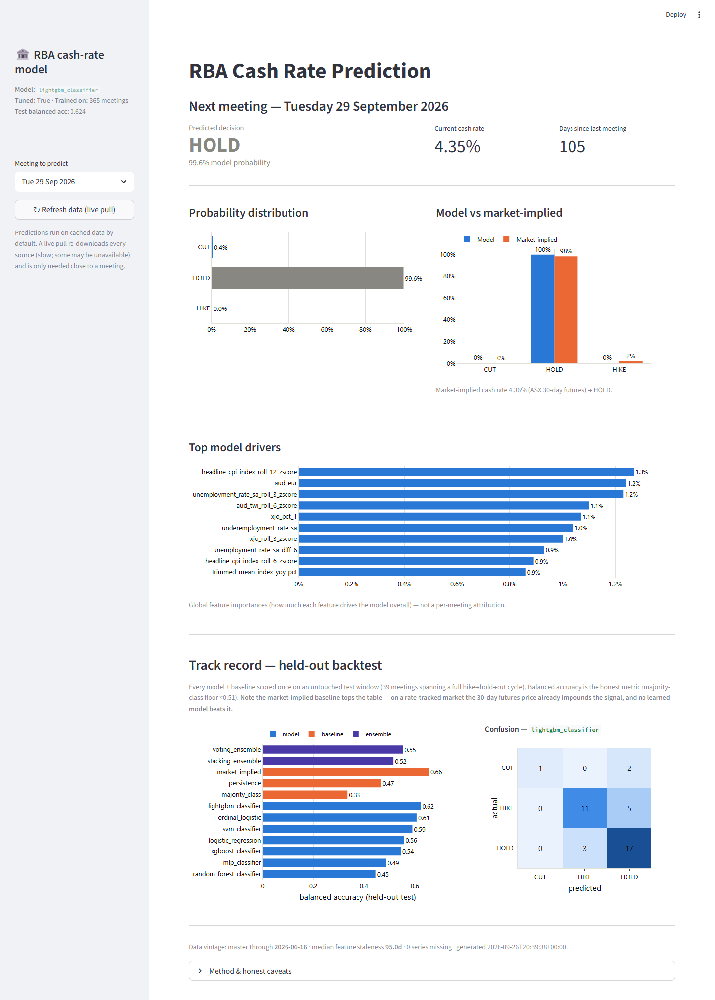

# RBA Cash Rate Prediction

[](https://github.com/tyegazzard/rba_cash_rate/actions/workflows/ci.yml)

[](LICENSE)
[](https://cookiecutter-data-science.drivendata.org/)

An end-to-end machine-learning pipeline that predicts the Reserve Bank of Australia's next cash-rate decision (**cut / hold / hike**) before each Board meeting, and benchmarks every model against the ASX 30-day interbank futures market.

The pipeline ingests 120 economic and market series, the RBA's decision history and the ASX futures curve through 23 provenance-tracked source modules, and aligns them to each meeting under a strict point-in-time rule. It then tunes seven classifiers with walk-forward cross-validation on a development window, adds two ensembles and four baselines, and scores everything **once** on an untouched 39-meeting test window that spans a full hike → hold → cut cycle. A Streamlit dashboard and a CLI serve the persisted best model on the next scheduled meeting.



> **Headline result (an honest null):** the market-implied baseline derived from ASX futures is the single best predictor on the held-out window, with a balanced accuracy of 0.921. The best learned model, a tuned LightGBM, reaches 0.624, and **no model beats the market**. On a liquid, rate-tracked market the futures curve already impounds the macro signal the models are trying to learn. See [Results](#results).

---

## Contents

- [Problem statement](#problem-statement)
- [Approach](#approach)
- [Quick start](#quick-start)
- [Data](#data)
- [Point-in-time discipline](#point-in-time-discipline)
- [Features](#features)
- [Models and baselines](#models-and-baselines)
- [Evaluation protocol](#evaluation-protocol)
- [Results](#results)
- [Before-meeting predictions and dashboard](#before-meeting-predictions-and-dashboard)
- [Repository structure](#repository-structure)
- [Limitations](#limitations)
- [Roadmap](#roadmap)
- [Licence and acknowledgements](#licence-and-acknowledgements)

---

## Problem statement

Eight times a year (eleven before 2024) the RBA Board announces its cash-rate target at 2:30 pm at the end of its meeting; since February 2024 that is the second day of a two-day Monetary Policy Board meeting. This project asks one question at each announcement date: **given only information published strictly before today, will the Board cut, hold, or hike?**

| Design choice | Decision |
|---|---|
| Prediction unit | One Board meeting. `meeting_date` is the *announcement* date from the RBA's published cash-rate decision history (the project's `rba_f11` source, referred to as F11 below) |
| Primary target | `three_class`: the sign of the rate change → `cut` / `hold` / `hike`. Four further formulations are configured in `targets.yaml` (magnitude class, ordinal, Δ-rate regression, level regression); the learned models are evaluated only on `three_class`, `level_regression` is used solely to score the Taylor-rule baseline, and the other three are not exercised |
| History | Inflation-targeting era, 1993-02-03 → 2026-06-16: **365 meetings** in the current snapshot |
| Class balance (full history) | hold 281 (77.0 %) · hike 43 (11.8 %) · cut 41 (11.2 %) |
| Held-out test window | The 39 meetings on or after **2022-05-01** (16 hike / 20 hold / 3 cut): the 2022–23 tightening cycle, the 2024 plateau, the 2025 cuts and the three hikes of February to May 2026. The 326 earlier meetings are the development window |
| Headline metric | **Balanced accuracy**, alongside macro-F1, log-loss, Brier score, calibration error and hit rate versus the market. Raw accuracy is reported but not ranked on: "always hold" scores 77 % over the full history and 51 % on the test window (20 of 39 meetings), so accuracy mostly measures the hold share |
| Benchmark | The ASX 30-day interbank cash-rate futures curve, read the trading day before each meeting |

A model only earns its keep if it beats the futures market. That bar is deliberately high, and the project documents how far short the models fall rather than hiding it.

## Approach

```
 RBA · ABS · FRED · Yahoo Finance · ASX-futures mirror     src/rba/data/sources/  (one fetch() per source)
        │  dated raw snapshot + SHA-256 provenance in _metadata.json
        ▼
 data/raw/<source>/                                        python -m rba.data.refresh
        │  read-only parse; release calendars attach publication dates
        ▼
 point-in-time as-of join (publication_date < meeting_date, strict)
 + regime dummies + staleness (_age_days) + missingness flags     python -m rba.data.align
        ▼
 data/processed/master.parquet   (365 meetings × 377 columns)
        │  YAML-driven builders: lags · rolling · changes · target lags
        ▼
 data/processed/features.parquet (365 × 687 columns, 681 model inputs, hashed feature version)
        │  dev / test split at 2022-05-01
        ▼
 Optuna search + decision-threshold tuning, walk-forward CV on dev only   python -m rba.validation.campaign
        ▼
 expanding walk-forward through the 39-meeting test window                python -m rba.validation.report
        ▼
 reports/results.md · holdout_metrics.csv · calibration figures · best_model/lightgbm_classifier.joblib
        ▼
 leakage-safe feature row for the next scheduled meeting                  python -m rba.models.predict_next
        ▼
 CLI prediction log · Streamlit dashboard                                  streamlit run streamlit_app/main.py
```

Every pipeline stage is a plain `python -m rba.<module>` command that reads only artefacts written by earlier stages (the dashboard, launched with `streamlit run`, is the one exception). Fetches add new dated snapshots rather than editing existing ones.

## Quick start

Prerequisites: [uv](https://docs.astral.sh/uv/) and Git. The project pins Python 3.11 (`requires-python = "~=3.11.0"`); uv downloads it if it is not installed.

```bash
git clone https://github.com/tyegazzard/rba_cash_rate.git
cd rba_cash_rate
uv sync                                       # environment from uv.lock (runtime + dev tools)
uv run pytest                                 # 1,639 tests on synthetic data; a few real-data tests skip until data exists

# 1. Data (network; the only step that downloads anything)
uv run python -m rba.data.refresh             # every registered source → data/raw/<source>/
uv run python -m rba.data.refresh --list      # show the registry
uv run python -m rba.data.refresh --source abs_cpi --source rba_f11   # a subset
uv run python -m rba.data.refresh --no-download                       # re-parse cached snapshots without downloading

# 2. Point-in-time master frame and features (offline, read-only over data/raw)
uv run python -m rba.data.align               # → data/processed/master.parquet
uv run python -m rba.features.build           # → data/processed/features.parquet

# 3. Predict the next meeting / open the dashboard
uv run python -m rba.models.predict_next
uv run streamlit run streamlit_app/main.py

# 4. Reproduce the evaluation (Optuna is capped at 30 trials or 300 s per model; narrow with --models / --n-trials / --timeout)
uv run python -m rba.validation.campaign      # dev-only tuning → reports/tuned/
uv run python -m rba.validation.report        # held-out suite → reports/results.md, best_model/
uv run python -m rba.validation.report --no-figures --no-persist   # quicker re-score without figures or model refit
uv run python -m rba.features.importance      # → reports/feature_importance.md
uv run python -m rba.data.inventory           # → DATA.md
```

Steps 1 and 2 are needed on a fresh clone because `data/` is git-ignored; the pre-trained model and evaluation reports under `reports/` are tracked, so the CLI and dashboard work as soon as raw data has been fetched. The refresh isolates per-source failures (network errors, the RBA firewall's HTTP 403 on custom User-Agent headers, parse errors), logs them, continues, and exits non-zero if any source failed. The registry also includes the four text scrapers, which are slow, and the media-release and speech crawls currently abort part-way (see [Limitations](#limitations)); the numeric sources are unaffected.

Developer tooling: `ruff` (lint and format, line length 99), `mypy` (typed definitions required on `src/`, relaxed for `tests/`), and pre-commit hooks that run ruff, mypy and the full test suite (`uv run pre-commit install`). GitHub Actions runs the same checks with coverage on every push and pull request to `main`. There are no console-script entry points; every pipeline command is `python -m rba.<module>`, and the dashboard is launched with `streamlit run`.

## Data

All data is public and **no API key, token or environment variable is required**. Each source module exposes `fetch()`, writes dated raw snapshots under `data/raw/<source>/`, and records the URL, SHA-256, byte count and download timestamp in `_metadata.json` (the manifest is rewritten on every `fetch()`, so the dated snapshot files are the durable provenance record; the two text crawls that currently abort part-way leave no manifest). Every observation carries both an `observation_date` (the period it describes) and a `publication_date` (when it became public); observations older than a release calendar's verified range, mostly pre-1993, keep a null publication date and are dropped by the as-of join rather than guessed.

| Family | Series | Provider and access |
|---|---|---|
| **Target**: cash-rate decisions | Every Board meeting since January 1990 with the new rate, the change, and links to the statement and minutes (the prior rate is derived downstream) | RBA cash-rate target page (`rba_f11`), scraped from its HTML table |
| **Australian macro** | Headline, trimmed-mean and weighted-median CPI · unemployment, underemployment and participation rates · wage price index (all, private, public) · real, nominal and per-capita GDP · building approvals · total value of dwellings with capital-city median prices and transfer counts | ABS Data API (SDMX-JSON); two seasonally adjusted and trend building-approvals series come from RBA table H3 |
| **RBA aggregates** | D1/D2 credit and broad-money aggregates · E2 household debt-to-income ratios · I2 index of commodity prices | RBA statistical tables (CSV) |
| **Sentiment surveys** | NAB business conditions · Westpac–Melbourne Institute consumer sentiment | RBA table H3 |
| **Australian markets** | ASX 30-day interbank futures curve · Commonwealth bond yields at 2, 3, 5 and 10 years (F2) · BBSW at 1, 3 and 6 months (F1) · AUD against USD, TWI, JPY, EUR, GBP, CNY and NZD (F11.1) · S&P/ASX 200 with financials, materials, resources and energy sub-indices | RBA tables (live CSV; BBSW and AUD spliced with their historical XLS archives) · Yahoo Finance chart endpoint · daily mirror of the ASX MarkitDigital feed published by [MattCowgill/cash-rate-scraper](https://github.com/MattCowgill/cash-rate-scraper) |
| **Global** | US headline and core CPI · effective Fed funds rate · US 10-year Treasury yield · Fed broad USD index · VIX · iron ore · copper · Brent · WTI | FRED unauthenticated CSV endpoint (IMF and EIA series are also fetched through FRED) |
| **Text (ingest only)** | Post-meeting media releases · Board minutes · Statement on Monetary Policy overviews · official speeches | RBA website scrapers. Built and cross-checked, **not used by any model in v1** (see [Limitations](#limitations)) |

That is 120 numeric series from 17 modules, plus the decision history, the futures curve, and four text scrapers, for 23 source modules in total.

**Release calendars.** Knowing *when* a number became public is the whole game. Fourteen `*_release_calendar.py` modules under `src/rba/data/` reconstruct publication dates. Nine are algorithmic rules (for example ABS Labour Force: second Thursday of the following month for reference months before 2016, third Thursday since; RBA financial aggregates: last weekday of the following month). Five scrape the original release dates where no clean rule exists (WPI, GDP, building approvals, total value of dwellings, and RBA household ratios via the Wayback Machine) and persist them under `data/external/*_release_dates.csv`, the only data files tracked in git. Daily market series publish the same day (AUD, ASX 200 and the futures curve, stamped inline) or the next Australian business day (bond yields and BBSW, via the yields calendar).

**Inventory.** `python -m rba.data.inventory` regenerates [DATA.md](DATA.md), a catalogue of every registered series with its dataflow, URL, snapshot, observation count and last observation date. Its `--check` flag reports any registered series with no matching `_metadata.json` row on disk and exits non-zero; a unit test exercises the same guard on a synthetic raw tree. The committed DATA.md predates the latest refresh; regenerate it after refreshing.

**What is checked in.** Raw and processed data are git-ignored, so a fresh clone must run the refresh once. The evaluation artefacts under `reports/`, including the persisted best model, **are** tracked.

## Point-in-time discipline

The project's invariants are written down in [CONTEXT.md](CONTEXT.md) and enforced by tests:

1. **Strict point-in-time joins.** A value is usable at meeting `t` only if `publication_date < t`, enforced with `merge_asof(allow_exact_matches=False)`, so a same-day CPI print or the post-meeting statement counts as not yet known. `tests/data/test_no_leakage.py` injects synthetic future data and asserts it never reaches the frame.
2. **Staleness is explicit.** Every series carries `<sid>_age_days` (days since its last publication) and `<sid>_is_missing`, so a carried-forward value can never masquerade as fresh.
3. **No random cross-validation.** Only the expanding `WalkForwardSplit`; rolling statistics are trailing windows; z-scores use rolling moments.
4. **No test-set contamination.** Hyper-parameters and decision thresholds are chosen on the development window (meetings before May 2022) only, and any imputer or scaler is fitted inside each fold.
5. **Outcome columns never enter `X`.** `feature_columns()` is the single definition of the model input and drops `rate_change_bps` and `new_rate_pct`; a regression test checks that a greedy decision tree cannot reach trivially perfect accuracy.
6. **Reproducibility.** `RANDOM_SEED = 12`, a `uv.lock` lockfile, hashed raw snapshots, and a feature-version hash (config plus builder source) written to `features.meta.json`.

## Features

`rba.data.align` builds the 377-column master frame (point-in-time levels with their staleness and missingness companions, regime dummies and meeting metadata); `src/rba/features/build.py` then adds the YAML-driven groups from `features.yaml` on top of it. Lag and rolling windows are expressed in **meetings**, not calendar months, so the February 2024 cadence change (11 → 8 meetings a year) does not silently change window lengths.

| Group | What it adds | Columns |
|---|---|---|
| Point-in-time levels | The as-of value of all 120 series plus `_age_days` and `_is_missing` companions | 360 |
| Regime dummies | Governor eras (Fraser, Macfarlane, Stevens, Lowe, Bullock), GFC, COVID, yield-curve-control forward guidance, post-2024 cadence | 9 |
| Meeting frame | `prior_rate_pct` and `gap_days_since_last_meeting` (model inputs) plus six non-feature columns: the meeting and effective dates, the statement and minutes URLs, and the two outcome columns | 8 |
| Lags | Values as of 1, 2, 3, 6 and 12 meetings ago for 16 core macro and market series | 80 |
| Rolling | Mean, std, z-score, min, max and EWMA over 3, 6 and 12 meetings for 9 series, trailing only | 162 |
| Changes | Meeting-space differences and % changes over 1, 3, 6 and 12 meetings, plus calendar-anchored year-over-year for CPI indices, house prices, commodities and the ASX 200 | 62 |
| Target lags | The previous 1, 2 and 3 decisions (`rate_change_bps`, `new_rate_pct`) | 6 |
| Surprises | Realised minus consensus; **inert** until a consensus source exists | 0 |
| Text | Loughran-McDonald lexicon scorer implemented and tested, but text is a **deferred group**: no text column reaches the model | 0 |

The result is a 687-column frame of which 681 are model inputs (dates, URLs and the two outcome columns are excluded). A descriptive, in-sample importance report (Pearson, Spearman, mutual information) is generated by `python -m rba.features.importance` into [reports/feature_importance.md](reports/feature_importance.md).

## Models and baselines

Every model implements one `Model` protocol (`fit` / `predict` / `predict_proba` / `feature_names_`) and is built from `models.yaml` by `build_model()`, so baselines and learners are interchangeable in the evaluation harness. Adding a model means writing one wrapper class and one YAML entry.

**Baselines (floors):**

| Baseline | Rule |
|---|---|
| `majority_class` | Always `hold`; probabilities equal the empirical class prior |
| `persistence` | Repeat the previous decision |
| `taylor_rule` | Prescribed rate level `î = α + φ_π·π + φ_y·gap`, either with Taylor's literature coefficients (1.5, 0.5) and an intercept built from a 3.0 % neutral rate and 2.5 % inflation target, or OLS-fitted on the training window (the reported run uses the OLS-fitted mode, refit at each walk-forward step). Scored as a level regression; a cut/hold/hike call is derived from the prescribed level minus the standing rate with a 12.5 bp dead-band |
| `market_implied` | ASX 30-day futures implied post-meeting rate at T-1: the meeting-month contract with its monthly average unwound when the meeting falls in the first half of its month, otherwise the following month's contract; `Δ = implied − current rate` mapped to `P(hike) = clip(Δ / 25 bp, 0, 1)`, symmetrically for cuts, remainder to hold |

**Learned models:** logistic regression (L1/L2), random forest, XGBoost, LightGBM, SVM (linear/RBF), ordinal logistic (`mord`) and an MLP, plus a soft-voting ensemble and a stacking ensemble whose meta-learner trains on out-of-fold base probabilities. Tree models receive NaN natively; the dense models (logistic regression, SVM, MLP, ordinal logistic) fit a per-fold forward-fill imputer and scaler inside their own pipeline. Five of the seven learners counter the hold prior with balanced class weights by default (logistic regression, random forest, SVM and LightGBM via `class_weight='balanced'`, XGBoost via equivalent per-sample weights); the MLP and the ordinal model train unweighted. Two further meta-estimators are registered and unit-tested for experiments, per-fold top-k feature selection and per-fold SMOTE, but they are not part of the reported comparison. An xRFM wrapper exists as a stub only.

## Evaluation protocol

1. **Split** at `TEST_WINDOW_START = 2022-05-01`. The 326 earlier meetings are the development window; the 39 on or after it are scored exactly once.
2. **Tuning campaign** (`python -m rba.validation.campaign`): for each of the seven learners, a seeded Optuna search over its `models.yaml` search space, scored by walk-forward CV *within* the development window, then per-class decision-threshold weights fitted on development out-of-fold probabilities to counter the hold prior (80 % of the development window). Results persist to `reports/tuned/<model>.json`. The default budget is 30 trials or 300 seconds per model.
3. **Held-out evaluation** (`python -m rba.validation.report`): an **expanding walk-forward that runs through the test window**. Each test meeting is predicted by a model retrained on every meeting strictly before it, with hyper-parameters frozen from step 2. This mirrors real before-each-meeting retraining. Reported predictions are the plain argmax of the class probabilities; the dev-tuned thresholds produce a secondary `bal_acc_tuned` column in `holdout_metrics.csv` that is reported but not ranked on.
4. **Metrics**: accuracy, balanced accuracy, macro-F1, log-loss, Brier score, per-class expected calibration error with reliability diagrams, confusion matrices, and hit rate versus the market baseline paired on the same meetings.
5. **Error analysis** of the best model by regime, cycle phase and market-surprise meetings.
6. **Persistence**: the best learned model is refit on all 365 meetings and saved to `reports/best_model/` for serving.

## Results

Full write-up: [reports/results.md](reports/results.md), generated 2026-09-29. Ranked by argmax balanced accuracy on the 39-meeting held-out window. The dev-tuned per-class thresholds are scored separately as `bal_acc_tuned` in `reports/holdout_metrics.csv`: they lift XGBoost to 0.625 but lower LightGBM to 0.611, so on N = 39 they are reported but not ranked on.

| Model | Kind | Accuracy | Balanced acc. | Macro-F1 | Log-loss | Lift vs market |
|---|---|---|---|---|---|---|
| **market_implied** | baseline | 0.897 | **0.921** | 0.886 | — | — |
| lightgbm_classifier | model | 0.744 | 0.624 | 0.669 | 1.280 | −0.154 |
| ordinal_logistic | model | 0.718 | 0.607 | 0.612 | 3.153 | −0.179 |
| svm_classifier | model | 0.692 | 0.590 | 0.594 | 0.736 | −0.205 |
| logistic_regression | model | 0.641 | 0.557 | 0.557 | 1.779 | −0.256 |
| voting_ensemble | ensemble | 0.641 | 0.553 | 0.571 | 0.972 | −0.256 |
| xgboost_classifier | model | 0.615 | 0.544 | 0.538 | 0.856 | −0.282 |
| stacking_ensemble | ensemble | 0.564 | 0.515 | 0.475 | 1.787 | −0.333 |
| mlp_classifier | model | 0.564 | 0.486 | 0.528 | 2.505 | −0.333 |
| persistence | baseline | 0.641 | 0.467 | 0.467 | 12.939 | −0.256 |
| random_forest_classifier | model | 0.615 | 0.446 | 0.427 | 0.863 | −0.282 |
| majority_class | baseline | 0.513 | 0.333 | 0.226 | 1.240 | −0.385 |

*The market baseline covers all 39 meetings (futures coverage runs from 21 April 2022). Lift is model accuracy minus market accuracy on the same meetings. The market figures were restated on 2026-09-29 after the contract-selection rule was corrected: the earlier rule read the meeting-month contract for every meeting, which hid decisions made late in a month, and scored 0.656 balanced accuracy on 38 meetings. Model scores are unchanged.*

**What the numbers say**

- **The market wins.** Every learned model has negative lift against the futures-implied call. On the 4 meetings where the market was wrong, LightGBM was right 75 % of the time, against 74 % on the 35 meetings the market got right.
- **LightGBM is the best learned model** (tuned to 120 trees, 119 leaves, learning rate 0.20, balanced class weights). Its held-out confusion matrix (rows = actual, columns = predicted):

  | | cut | hike | hold |
  |---|---|---|---|
  | **cut** | 1 | 0 | 2 |
  | **hike** | 0 | 11 | 5 |
  | **hold** | 0 | 3 | 17 |

- **Cycle turns are where it fails.** Recall is 0.85 on holds, 0.69 on hikes and 0.33 on cuts. Accuracy is 0.84 in tightening and 0.86 in easing phases but 0.54 on plateaus. Eight of the ten misses cluster at the start of the 2022 hiking cycle (May to July 2022 called hold), the 2023 pauses (called hike) and the February and August 2025 cuts (called hold); the other two are the November 2023 and February 2026 hikes, both called hold.
- **Ensembles did not help.** Voting (0.553) and stacking (0.515) both trail the best individual model.
- **Calibration is mediocre.** Per-class expected calibration error for LightGBM is 0.08 / 0.20 / 0.27 for cut / hike / hold. The random forest is the best-calibrated learner (0.10 / 0.05 / 0.11) despite ranking near the bottom on balanced accuracy, and the SVM has the best log-loss and Brier score. Reliability diagrams are in `reports/figures/`.
- **The Taylor rule is a weak directional signal here.** With proxy inputs it reaches a level RMSE of 3.37 percentage points and prescribes a hike at 32 of the 39 test meetings.
- **Development-window ranking differs.** Ordinal logistic beat LightGBM on development CV (0.584 vs 0.573 balanced accuracy) but not on the test window, and the persisted campaign records only 3 to 19 completed Optuna trials for six of the seven learners.

With N = 39, differences of a few points of balanced accuracy are within sampling noise; the ranking is indicative, not decisive.

## Before-meeting predictions and dashboard

`python -m rba.models.predict_next` serves the persisted best model on the next scheduled meeting:

1. `rba.data.meeting_schedule` supplies the hand-verified forward announcement dates as a checked-in tuple (`python -m rba.data.meeting_schedule` reconciles its past portion against the cached F11 history).
2. `align.append_future_meeting()` appends an undecided row (outcome columns NaN, prior rate = last decision) *before* the point-in-time join, so the row is populated only from data published before that date. The master and feature frames are rebuilt in memory from the raw cache; the processed parquet files are not needed.
3. The row is reindexed to the model's `feature_names_`, the LightGBM artifact in `reports/best_model/` predicts, and the market-implied baseline is scored alongside when the futures contract that prices the meeting is quoted.
4. The result (class probabilities, market comparison, top global feature importances, a data-vintage and staleness summary, git commit, UTC timestamp) is returned as a `PredictionResult`; the CLI prints a compact summary (or the full object with `--json`) and appends it as one JSON line to `reports/predictions/predictions.jsonl` unless `--no-log` is passed.

```
$ uv run python -m rba.models.predict_next --help
usage: rba.models.predict_next [-h] [--meeting-date YYYY-MM-DD] [--refresh]
                               [--model-path MODEL_PATH] [--top-n TOP_N]
                               [--json] [--no-log]

Predict the next (not-yet-decided) RBA cash-rate decision.

options:
  -h, --help            show this help message and exit
  --meeting-date YYYY-MM-DD
                        Meeting to predict (default: next scheduled meeting).
  --refresh             Pull every source live before predicting (default:
                        cached raw).
  --model-path MODEL_PATH
                        Override the .joblib artifact path.
  --top-n TOP_N         Top global feature drivers to show.
  --json                Print the full result as JSON.
  --no-log              Do not append to the prediction log.
```

`--top-n` defaults to 10.

The **Streamlit dashboard** (`uv run streamlit run streamlit_app/main.py`) wraps the same function: headline call and confidence, cut/hold/hike probabilities, model-versus-market comparison, top drivers (global feature importances, not a per-meeting attribution), and a held-out track-record panel (leaderboard plus the best model's confusion matrix) that shows the market baseline topping the table. The prediction takes a few seconds on cached data and is memoised with `st.cache_data`; a sidebar button triggers a live refresh. Dashboard runs do not write to the prediction log, and the app runs locally only; nothing is deployed or scheduled.

Predictions run on cached raw snapshots by default. The market comparison needs a quote for the contract that prices the meeting (its own month's, or the following month's when the meeting falls in the second half of the month) within the seven business days before the meeting, so refresh (CLI `--refresh` or the dashboard button) in the week before a meeting to see it.

## Repository structure

```
rba_cash_rate/
├── src/rba/
│   ├── config/                  # constants (RANDOM_SEED=12, TEST_WINDOW_START, paths) + features.yaml, models.yaml, targets.yaml
│   ├── data/
│   │   ├── sources/             # 23 fetch() modules: rba_f11 (target), abs_* (6), rba_d, rba_e2_household_ratios,
│   │   │                        #   rba_i2_commodity_prices, asx_ib_futures, agb_yields, aud_exchange_rates, asx_200, bbsw_rates,
│   │   │                        #   commodity_prices, fred_global_signals, nab_business_survey, westpac_mi_consumer_sentiment,
│   │   │                        #   rba_media_releases, rba_minutes, rba_somp, rba_speeches (text)
│   │   ├── *_release_calendar.py   # 14 publication-date calendars (what was knowable when)
│   │   ├── refresh.py           # CLI: re-pull every source with per-source error isolation
│   │   ├── inventory.py         # CLI: generate DATA.md
│   │   ├── align.py             # CLI: point-in-time master frame, regime dummies, future-meeting row
│   │   ├── meeting_schedule.py  # forward RBA meeting dates, validated against F11
│   │   └── targets.py, preprocess_target.py, validate_decisions.py
│   ├── features/
│   │   ├── build.py             # CLI: YAML-driven feature frame → features.parquet; feature_columns() / dev_test_split()
│   │   ├── lags.py, rolling.py, changes.py, surprises.py, target_lags.py
│   │   ├── importance.py        # CLI: in-sample correlation / mutual-information report
│   │   ├── versioning.py        # feature-version hash (config + code)
│   │   └── text/lexicon.py, lexicon_data.py   # Loughran-McDonald scorer (standalone; deferred from the model)
│   ├── models/
│   │   ├── base.py              # Model protocol / BaseModel; build_model() factory in __init__.py
│   │   ├── baselines.py         # majority class, persistence, Taylor rule, market-implied
│   │   ├── sklearn_wrappers.py, xgb.py, lgbm.py, ordinal.py, ensemble.py, selection.py, imbalance.py
│   │   ├── _preprocessing.py    # per-fold forward-fill imputer (dense models) and balanced sample weights (XGBoost)
│   │   ├── xrfm.py              # deferred stub
│   │   └── predict_next.py      # CLI: next-meeting prediction from reports/best_model/
│   ├── validation/
│   │   ├── cv.py                # WalkForwardSplit
│   │   ├── metrics.py, calibration.py, thresholds.py, tuning.py (Optuna)
│   │   ├── harness.py           # evaluate(): walk-forward evaluation → reports/runs/<run_id>/
│   │   ├── campaign.py          # CLI: dev-only tuning campaign → reports/tuned/
│   │   ├── holdout.py           # held-out test-window evaluation, market and Taylor baselines
│   │   ├── report.py            # CLI: full suite → results.md, holdout_metrics.csv, figures/, best_model/
│   │   └── error_analysis.py
│   └── viz/                     # empty package
├── streamlit_app/main.py        # dashboard
├── tests/                       # mirrors src/ (83 modules, 1,639 tests)
├── data/                        # raw / interim / processed / external; git-ignored except external/*_release_dates.csv
├── reports/                     # tracked: results.md, holdout_metrics.csv, baselines.md, feature_importance.*,
│                                #   tuned/, runs/, figures/, best_model/; predictions/ holds only a placeholder (the JSONL log is local)
├── docs/dashboard.png           # screenshot used above
├── models/, notebooks/, references/   # empty scaffold placeholders
├── CONTEXT.md                   # full specification, invariants and architectural decisions
├── CHECKLIST.md                 # project plan and progress
├── PROJECT_SUMMARY.md           # one-page inventory of what was built
├── DATA.md                      # generated data catalogue
└── pyproject.toml, uv.lock, Makefile, .pre-commit-config.yaml, .github/workflows/ci.yml
```

## Limitations

- **The market beats the models.** Any claim of skill would rest on the eight market-surprise meetings, where N is far too small to conclude anything.
- **Small test window.** 39 meetings covering one cycle; the leaderboard ordering is indicative only, and several tuned configurations were lightly searched (3 to 19 completed Optuna trials for six of the seven learners).
- **Data vintage.** Macro features use the *current* ABS, RBA and FRED vintage at download time, not the first-release values the Board actually saw. Statistical agencies revise history (seasonal re-estimation, methodology changes, late data), so for revised periods the value next to a `publication_date` is not exactly what was known on that date. The bias is small for headline CPI and larger for labour-force sub-aggregates and GDP. Where a scraped release calendar does not reach back far enough, conservative flat publication offsets are used instead. Planned mitigations: scheduled vintage accumulation (capture each release as it lands so future test-window meetings can be evaluated on genuinely real-time data), optional manual back-population of first-release values for the test window from Statement on Monetary Policy tables, and an ALFRED-derived release calendar for the FRED series; see "Vintage policy" in [CONTEXT.md](CONTEXT.md).
- **Market baseline coverage starts on 21 April 2022**, when the upstream futures scraper began; no free pre-2022 history of the ASX 30-day contract exists, so the market comparison is only possible on the test window.
- **No text signal.** The four RBA text scrapers and the Loughran-McDonald scorer exist, but the point-in-time alignment of documents onto the meeting frame was never built, and the media-release and speech crawls are incomplete (34 of 230 and 22 of about 1,340 documents): the speech crawl aborts on a `datePublished` rendered as a date range, and the media-release crawl on pages with no `datePublished` element. Embeddings and a custom hawkish/dovish dictionary are deferred.
- **Taylor-rule inputs are proxies.** Trimmed-mean CPI year-over-year stands in for headline inflation and a negative unemployment gap stands in for the output gap.
- **MLflow is wired but unusable on this stack.** The code paths exist, but `mlflow` cannot be imported with the locked dependency set (the pinned release is incompatible with the project's pandas 3 and protobuf 7), so tracking calls degrade to warnings and the artefacts under `reports/` are the durable record.
- **Excluded series.** ABS Retail Trade was dropped because the ABS discontinued it after June 2025 (a frozen feature would grow staler at every meeting); the licensed ICE Dollar Index is replaced by the Fed's broad USD index; the RBNZ cash rate was dropped for lack of a current free feed.
- **Manual meeting schedule and snapshot age.** Forward meeting dates are a hand-verified tuple in `meeting_schedule.py` that currently ends with the December 2026 meeting; each year's dates must be appended when the RBA publishes them, and the CLI logs a clear error and exits non-zero rather than guessing once the list is exhausted. The snapshot behind the reported results dates from 2026-07-12; later meetings enter the frame only after a fresh refresh and rebuild.

## Roadmap

Progress is tracked in [CHECKLIST.md](CHECKLIST.md). Open items:

- Fix publication-date extraction in the media-release and speech scrapers (speeches abort on date-range values, media releases on pages with no `datePublished` element) and re-crawl, then build the point-in-time text alignment so lexicon scores (and later embeddings) can enter the model.
- EDA notebooks (target distribution, macro series, market vs actual, text corpus, regime changes).
- xRFM classifier (stub only), custom hawkish/dovish dictionary, fine-tuned sentiment.
- Deploy the dashboard to Streamlit Community Cloud, tag a v1.0.0 release, and optionally submit to an external RBA forecast benchmark.

## Licence and acknowledgements

MIT. See [LICENSE](LICENSE).

Data and tools this project stands on:

- [Reserve Bank of Australia](https://www.rba.gov.au/statistics/tables/) statistical tables, cash-rate history, media releases, minutes, statements and speeches.
- [Australian Bureau of Statistics](https://www.abs.gov.au/) Data API.
- [FRED](https://fred.stlouisfed.org/), Federal Reserve Bank of St. Louis, including IMF commodity and EIA oil series.
- [MattCowgill/cash-rate-scraper](https://github.com/MattCowgill/cash-rate-scraper) (MIT) for the daily ASX 30-day futures curve history.
- Yahoo Finance for S&P/ASX 200 index history.
- [Internet Archive Wayback Machine](https://web.archive.org/) CDX API for reconstructing RBA household-ratio (E2) release dates.
- [Loughran-McDonald Master Dictionary](https://sraf.nd.edu/loughranmcdonald-master-dictionary/) (Notre Dame Software Repository for Accounting and Finance) for the financial sentiment lexicon.
- [Tomasz Woźniak's RBA cash-rate forecasts](https://forecasting-cash-rate.github.io/) as an external benchmark reference.
- Project scaffold from [cookiecutter-data-science](https://cookiecutter-data-science.drivendata.org/); environment managed by [uv](https://docs.astral.sh/uv/).
